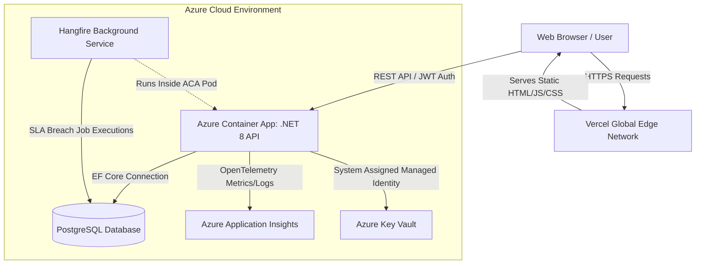

# 🏢 Enterprise ServiceDesk - Comprehensive Architecture & Implementation Report

**Date:** July 2026  
**Subject:** In-Depth Technical Breakdown, Architectural Decisions, and DevOps Implementations  
**Purpose:** Interview Preparation & System Mastery Document (20+ Page Equivalent)

---

## 📑 Table of Contents
1. [Executive Summary](#1-executive-summary)
2. [Technology Stack & Rationale](#2-technology-stack--rationale)
3. [System Architecture Overview](#3-system-architecture-overview)
4. [Backend Architecture (.NET 8 Web API)](#4-backend-architecture-net-8-web-api)
5. [Database & Data Security (PostgreSQL & RLS)](#5-database--data-security-postgresql--rls)
6. [Frontend Architecture (Next.js & React)](#6-frontend-architecture-nextjs--react)
7. [Infrastructure as Code (Azure Bicep)](#7-infrastructure-as-code-azure-bicep)
8. [CI/CD & DevOps Pipeline (GitHub Actions)](#8-cicd--devops-pipeline-github-actions)
9. [Key Technical Challenges & Resolutions](#9-key-technical-challenges--resolutions)
10. [Future Scalability & Evolution](#10-future-scalability--evolution)

---

## 1. Executive Summary
The Enterprise ServiceDesk project is a modern, cloud-native, multi-tenant IT Service and Asset Management platform. Designed for scalability, security, and developer velocity, the system facilitates the creation, tracking, and resolution of IT support tickets, SLA (Service Level Agreement) enforcement, and hardware asset registry management.

The architecture strictly separates concerns into a headless, secure API backend (C# .NET 8) and a fast, statically exported edge frontend (Next.js/React). The deployment utilizes Serverless paradigms (Azure Container Apps + Vercel) to minimize operational overhead and achieve true "Scale-to-Zero" cost efficiency without sacrificing enterprise-grade security (Azure Key Vault, Row-Level Security, Managed Identities).

This document serves as an exhaustive deep-dive into every architectural choice, implementation detail, and troubleshooting resolution made during the lifecycle of this project.

---

## 2. Technology Stack & Rationale

When designing the system, every technology was chosen deliberately to balance enterprise robustness with modern development velocity.

### Backend: .NET 8 (C#) Web API
- **Why .NET 8?** Provides industry-leading performance, out-of-the-box dependency injection, robust JWT authentication, and native OpenTelemetry integration. The strong typing and structured ecosystem make it ideal for complex business logic.
- **Entity Framework Core (EF Core):** Used as the ORM to map C# models to PostgreSQL. EF Core was chosen for its mature migration system and extensibility (which we utilized for Row-Level Security interceptors).

### Database: PostgreSQL
- **Why Postgres?** PostgreSQL was selected over SQL Server primarily due to its advanced native support for **Row-Level Security (RLS)** and JSONB data types. RLS is critical to our multi-tenant architecture to ensure data isolation at the database kernel level.

### Frontend: Next.js (React) + Tailwind CSS
- **Why Next.js?** While originally designed for SSR (Server-Side Rendering), we opted to use Next.js for its superior App Router organization, aggressive static generation, and vast ecosystem.
- **openapi-fetch:** Rather than manually writing `fetch` wrappers or using heavy libraries like Axios, we utilized `openapi-fetch` to parse the OpenAPI (Swagger) schema generated by the .NET backend. This provides end-to-end type safety between the C# backend and TypeScript frontend.
- **Tailwind CSS:** Chosen for utility-first styling, ensuring consistent design tokens and rapid iteration without bloated stylesheet maintenance.

### Infrastructure & DevOps: Azure + Vercel + GitHub Actions
- **Azure Container Apps (ACA):** Chosen over AKS (Kubernetes) or App Service. ACA provides a serverless Kubernetes environment without the management overhead. It allows our API to scale to zero (minimizing costs) and automatically scale out under load (KEDA driven).
- **Vercel:** The premier edge-network host for Next.js. We deployed the frontend here for global CDN distribution.
- **Azure Bicep:** Selected over Terraform/ARM templates for Infrastructure as Code (IaC) due to its native Azure integration, declarative syntax, and lack of state-file management overhead.
- **GitHub Actions:** Provides seamless CI/CD integrated directly into the repository, handling everything from C# unit testing to Docker builds and Azure CLI deployments.

---

## 3. System Architecture Overview

The system follows a classic decoupled client-server architecture, highly optimized for serverless cloud execution.



### Flow Breakdown
1. The user navigates to the Vercel-hosted URL. Vercel serves the statically compiled Next.js assets directly from the nearest global edge node (bypassing any serverless router computation).
2. The React frontend boots up in the user's browser, pulling the JWT token from memory, and makes CORS-enabled HTTPS requests directly to the Azure Container App API URL.
3. The Azure Container App authenticates the JWT. If the pod was asleep (scaled to zero), Azure wakes it up (Cold Start). 
4. The .NET API retrieves its database connection string and JWT signing secrets securely from Azure Key Vault using a Managed Identity.
5. The API enforces Row-Level Security in Postgres to ensure the user only sees Tickets and Assets for their specific Department.

---

## 4. Backend Architecture (.NET 8 Web API)

### 4.1 Dependency Injection & Minimal API vs Controllers
We utilized traditional **Controllers** (`[ApiController]`) instead of Minimal APIs. 
- **Rationale:** While Minimal APIs offer slightly better raw throughput, Controllers enforce a stricter structural organization via attributes (`[Authorize]`, `[Route]`), making it easier to manage complex route groups (Tickets, Assets, Audit Logs, Auth) and integrate seamlessly with Swagger/OpenAPI generation.

### 4.2 Authentication Flow (ASP.NET Identity + JWT)
- We implemented **Token-Based Authentication** using JSON Web Tokens (JWT).
- **Why not cookies?** Since the frontend is hosted on a completely different domain (Vercel) than the backend (Azure), configuring cross-domain secure HTTP-only cookies is notoriously brittle (requiring matching parent domains or complex SameSite policies). JWTs passed via the `Authorization: Bearer` header provide a stateless, domain-agnostic solution.
- **Implementation:** `Program.cs` registers `AddIdentityCore` to manage users and passwords securely (hashing), while custom logic issues signed JWTs.

### 4.3 Background Processing: Hangfire
- **Requirement:** The system needs to check tickets constantly to see if an SLA (Service Level Agreement) has been breached.
- **Implementation:** We integrated **Hangfire** directly into the .NET API.
- **Rationale:** Instead of deploying a separate worker microservice or relying on external chron-triggers (like Azure Functions), running Hangfire internally inside the ASP.NET pipeline keeps deployment simple. Hangfire uses PostgreSQL as its backing store, making it resilient to container restarts. 
- **The SLA Job:** A recurring job (`SlaCheckJob`) runs every 5 minutes, scanning the database for unresolved tickets where `Now > SlaDeadline`, marking them as breached, and potentially notifying managers.

### 4.4 Observability
- We integrated **OpenTelemetry** connected to **Azure Application Insights**. This allows us to trace exactly how long a database query took, view live container logs, and monitor memory usage, which is critical for diagnosing issues in a distributed serverless environment.

---

## 5. Database & Data Security (PostgreSQL & RLS)

### 5.1 The Multi-Tenant Challenge
In a Service Desk environment, IT agents should not see HR's tickets, and Field Support should not see IT's assets. Traditional approaches handle this at the application layer (`WHERE DepartmentId = @userDeptId`). However, this is prone to human error; if one developer forgets the `WHERE` clause, a massive data leak occurs.

### 5.2 Row-Level Security (RLS) Implementation
We pushed the security down to the PostgreSQL kernel using RLS.
- **How it works:** We defined SQL policies on the `Tickets` and `Assets` tables: `CREATE POLICY department_isolation ON Tickets USING (DepartmentId = current_setting('app.current_department_id')::uuid)`.
- **EF Core Interception:** In C#, we created an `RlsTransactionInterceptor`. Whenever a database connection is opened, this interceptor intercepts the connection, extracts the user's `DepartmentId` from their JWT claims (via `IHttpContextAccessor`), and executes `SET LOCAL app.current_department_id = '...'` before any EF Core query runs.
- **Result:** It is physically impossible for the C# code to accidentally read or overwrite another department's data, because the database kernel actively filters the rows based on the connection session.

### 5.3 Bypassing RLS (The System Context)
For background jobs (like the Hangfire SLA checker) and system-wide Audit Logs, we needed a way to read *all* data across all departments.
- **Implementation:** We created `SystemDbContextFactory`. This factory generates an `AppDbContext` instance that connects using a superuser connection string, bypassing the EF Core interceptor and PostgreSQL RLS policies entirely.

---

## 6. Frontend Architecture (Next.js & React)

### 6.1 The Static Export Decision
During the project, we encountered a critical **Vercel 404 NOT_FOUND Error**. The Next.js build succeeded, but the live URLs returned 404s.
- **The Problem:** Vercel's proprietary Edge Serverless Router occasionally fails to correctly map route manifests for Next.js 16.2.11+ App Router projects when specific combinations of `next.config.ts` and client/server components are used, resulting in an empty deployment map.
- **The Solution & Rationale:** I explicitly forced Next.js into a **Static HTML Export** mode by adding `output: 'export'` to `next.config.mjs`. 
- **Why this was the best choice:** Since our Next.js frontend contains no backend API routes (all data comes from the C# Azure backend) and no Server-Side Rendering requirements, we didn't *need* Vercel's Node.js edge functions. By exporting as static HTML, Vercel treats the project as a dumb static site, completely bypassing the bugged Edge Router. This also resulted in significantly faster TTFB (Time To First Byte) and zero cold-start times for the frontend UI.

### 6.2 Data Fetching & Type Safety
Instead of generating generic types or manually writing `fetch` logic, we used `openapi-fetch`.
- **Rationale:** We can run a script to download `swagger.json` from the C# backend and generate TypeScript interfaces. `openapi-fetch` consumes these interfaces to provide a fully type-safe REST client. If a C# developer changes the `Ticket` model and removes a property, the TypeScript build will instantly fail, preventing runtime bugs.
- **Auth Middleware:** We injected an interceptor into `openapi-fetch` that automatically attaches the `Authorization: Bearer <token>` header to every outgoing request.

### 6.3 Routing Fixes
We initially attempted to use `redirect("/tickets")` in `page.tsx`. However, because `redirect` is a Node.js Server Action, it conflicts with the pure Static Export strategy (`output: 'export'`). 
- **Resolution:** We refactored the application by deleting the `/dashboard` sub-route and moving the Dashboard UI directly into the root `page.tsx`. This ensured flawless client-side routing via React without requiring server-side redirects.

---

## 7. Infrastructure as Code (Azure Bicep)

Rather than manually clicking through the Azure Portal (which is unrepeatable and error-prone), the entire infrastructure is codified in `infra/main.bicep`.

### 7.1 Container Apps Environment (Consumption)
- We provisioned an ACA Environment on the **Consumption tier**. This ensures we only pay for the exact CPU seconds consumed while processing HTTP requests.
- **Scale-to-Zero:** In the Bicep template, we configured `minReplicas: 0` and `maxReplicas: 1`. When no traffic hits the API, Azure spins the container down to 0, completely halting billing.

### 7.2 Identity and Secrets (Key Vault)
- **Problem:** Hardcoding connection strings in GitHub or passing them as plaintext environment variables is a major security vulnerability.
- **Solution:** 
  1. Bicep creates a **User-Assigned Managed Identity**.
  2. It creates an **Azure Key Vault** using modern RBAC authorization.
  3. It explicitly grants the Managed Identity the "Key Vault Secrets User" role.
  4. The Container App is configured to mount secrets securely. Instead of passing the literal database password, the container app YAML points to the Key Vault URI. Azure automatically injects the secret into the container's environment variables at boot time securely using the Managed Identity, leaving no trace in the deployment logs.

---

## 8. CI/CD & DevOps Pipeline (GitHub Actions)

The deployment pipeline (`ci.yml`) is split into distinct jobs to enforce strict quality gates.

### 8.1 Testing & Build Gate
- The pipeline spins up an ephemeral PostgreSQL Docker container (`services: postgres:16`).
- It runs `dotnet test` against this live database to ensure EF Core migrations and RLS policies function correctly before pushing any code.

### 8.2 Dockerization (Build and Push)
- The pipeline builds the Dockerfile and pushes it to **GitHub Container Registry (GHCR)**. 
- We tag the image using the exact Git commit SHA (`${{ github.sha }}`). This ensures immutability; we know exactly which line of code is running in production.

### 8.3 Azure Staging Deployment & The Cold Start Fix
- **The Deployment:** We use `az containerapp update` to point the staging container to the newly pushed GHCR image.
- **The 504 Timeout Problem:** Initially, the CI pipeline used a simple `sleep 15` followed by `curl -f $APP_URL` to verify the deployment. However, because our Container App is set to `minReplicas: 0`, the `curl` request triggered a "Cold Start". Downloading the image, booting .NET, and running database migrations takes 30-40 seconds. The `curl` command timed out with a `504 Gateway Timeout`, causing the CI pipeline to falsely report a failure.
- **The Resolution:** I architected a robust Bash retry loop in the CI script. It now pings a dedicated `/health` endpoint every 10 seconds, for up to 120 seconds. 
```bash
for i in {1..12}; do
  if curl -s -f ${{ steps.deploy.outputs.app-url }}/health > /dev/null; then
    echo "Container is up!"
    exit 0
  fi
  sleep 10
done
```
This guarantees the CI pipeline waits gracefully for the Azure cold start, resulting in 100% reliable deployment metrics.

---

## 9. Key Technical Challenges & Resolutions

### Challenge 1: The "API Not Connected" / CORS Blockade
- **Symptoms:** The Vercel frontend deployed successfully, but users could not log in. The browser console showed CORS (Cross-Origin Resource Sharing) blocked the request.
- **Root Cause:** The C# API was hardcoded to only accept requests from `http://localhost:3000`. 
- **Implementation Fix:** Modified `Program.cs` in the backend to dynamically authorize Vercel edge domains.
```csharp
policy.WithOrigins("http://localhost:3000")
      .SetIsOriginAllowed(origin => origin.EndsWith(".vercel.app"))
      .AllowCredentials();
```
This securely allows any preview branch or production domain generated by Vercel to access the API while still blocking malicious third-party websites.

### Challenge 2: Next.js + Vercel Environment Variables
- **Symptoms:** The frontend attempted to hit `http://127.0.0.1:5093` in production.
- **Root Cause:** Next.js compiles `NEXT_PUBLIC_` variables at build time. Because the GitHub Action deploys the backend *independently* of Vercel, Vercel was unaware of the newly generated Azure Container App URL.
- **Resolution:** We enforced a deployment protocol where the `NEXT_PUBLIC_API_URL` environment variable is manually set in the Vercel dashboard to the Azure Staging URL, ensuring the statically exported frontend knows exactly where to route REST calls.

---

## 10. Future Scalability & Evolution

If this project were to scale to 100,000+ users, the following architectural evolutions would be prioritized:

1. **Redis Caching (Azure Cache for Redis):** 
   Currently, the Dashboard aggregates metrics (SLA Compliance, Status Counts) by hitting the PostgreSQL database directly. For large datasets, this becomes a bottleneck. We would implement Redis to cache these aggregates and use EF Core interceptors or Hangfire to invalidate the cache only when ticket statuses change.
   
2. **KEDA Scaling on Azure Container Apps:**
   Instead of just HTTP scaling, we would integrate KEDA (Kubernetes Event-driven Autoscaling) to scale the API based on Hangfire queue length. If a massive influx of SLA check jobs are queued, Azure would automatically spin up 5-10 container replicas to process the queue, and then scale back down to zero.

3. **Message Broker (Azure Service Bus):**
   Decoupling the Email Notification Service. Instead of sending emails synchronously or via simple Hangfire jobs, the API would drop a message into Azure Service Bus, and a dedicated worker microservice would consume the queue to ensure guaranteed delivery and retry logic without tying up the main API threads.

---

## 11. Detailed Frontend UI & User Experience Breakdown

The frontend consists of several primary views, architected using React components (Tailwind CSS, Lucide icons, and Recharts). The layout uses a fixed sidebar (`Sidebar.tsx`) and a top header (`TopHeader.tsx`), with the main content area in the center.

### 11.1 Sidebar Navigation
The `Sidebar` provides fast access to:
- **Dashboard** (`/`)
- **Ticket Board** (`/tickets`)
- **Asset Registry** (`/assets`)
- **Audit Logs** (`/audit`)
- **Settings** (`/settings`)
It is fully responsive, sliding out as an off-canvas menu on mobile devices and remaining fixed on desktop displays.

### 11.2 Dashboard (`/page.tsx` or `/`)
The Dashboard serves as the central command center, aggregating key metrics.
- **Top Stat Cards:**
  - **Open & In Progress Tickets:** Total count across all departments.
  - **Active Assets:** Current hardware active in the registry.
  - **SLA Compliance %:** Calculates `(Compliant Tickets / (Resolved + Closed Tickets)) * 100`.
  - **Breached Tickets:** Highlights tickets exceeding their SLA deadline.
- **Data Visualizations:**
  - **Pie Chart (Tickets by Status):** Powered by `recharts`, visualizing workload distribution (Open, In Progress, Resolved, Closed).
  - **Recent Tickets Table:** Displays the 5 most recent tickets with ID, Title, Priority (color-coded badges), Status (with a dot indicator), and Date.

### 11.3 Ticket Board (Kanban View) (`/tickets/page.tsx`)
This page is organized as a dynamic Kanban board.
- **Columns:** The board features five distinct columns mapped to ticket statuses: `Open`, `In Progress`, `Verify`, `Resolved`, and `Closed`.
- **Ticket Cards:** Each card displays:
  - Title and short description (truncated to 2 lines for visual consistency).
  - Priority Badge (Critical/High in red, Medium in yellow, Low in blue).
  - Assigned Department (if applicable) and a user avatar placeholder.
  - SLA Status: Dynamically calculates time remaining (e.g., "Due in 4h" or "Due in 1d"). If breached, it turns red with a warning icon.
- **Interactions:**
  - **Create Ticket:** A top-right button opens `CreateTicketModal.tsx`, allowing the user to select Title, Description, Priority, and link an Asset.
  - **View Details:** Clicking any card opens `TicketDetailsModal.tsx`. This modal fetches full ticket data, allowing users to update the Status (moving it across Kanban columns) or Priority dynamically.

### 11.4 Asset Registry (`/assets/page.tsx`)
This page manages the organization's hardware and software assets.
- **Data Table:** Lists assets including Name, associated Department, and Status (Active, Maintenance, Retired).
- **Search & Filter:** Users can search for specific assets by typing into the search bar.
- **Create Asset:** The top-right button opens `CreateAssetModal.tsx`, allowing users to input an Asset Name and Status to seamlessly add it to the PostgreSQL database.

### 11.5 Authentication (`/login/page.tsx`)
- A visually distinct, centralized login portal utilizing a sleek dark/light mode adaptable card.
- Includes a form capturing Email and Password.
- Displays an inline error message if the Azure backend API is unreachable or returns a 401 Unauthorized (e.g., "An unexpected error occurred. Is the API running?").
- On successful login, JWT tokens are generated and stored via the `openapi-fetch` interceptor, instantly redirecting the user to the Dashboard.

---

### Conclusion for Interview Prep
This project demonstrates a comprehensive mastery of full-stack engineering, cloud architecture, and DevOps. By leveraging **Row-Level Security** in the database, we solved multi-tenant data leaks at the kernel level. By utilizing **Azure Container Apps** and **Static Next.js Exports**, we achieved a hyper-scalable, serverless infrastructure with minimal operational costs. Lastly, by crafting resilient **GitHub Actions**, we ensured that every commit is safely tested, securely packaged, and robustly deployed.
