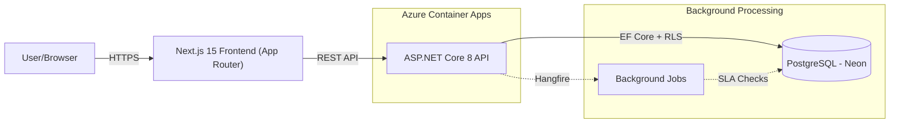

# ServiceDesk

ServiceDesk is a full-stack, enterprise-grade ticketing and IT service management platform built with ASP.NET Core 8 and Next.js. It provides robust Role-Based Access Control (RBAC), multi-department isolation via PostgreSQL Row-Level Security (RLS), automated SLA tracking with background jobs, and a complete audit trail.

## 🏗 Architecture

The system is split into two main components:
1. **Frontend:** Next.js 15 App Router SPA with TailwindCSS, running on `http://localhost:3000`.
2. **Backend:** ASP.NET Core 8 Web API.
3. **Database:** PostgreSQL (Neon) with EF Core.



## 🚀 Live Demo (Staging)

The application is deployed to Azure Container Apps and can be accessed here:
- **API (Swagger UI):** [https://ca-servicedesk-api-staging.wittysand-864c0963.uaenorth.azurecontainerapps.io/swagger/index.html](https://ca-servicedesk-api-staging.wittysand-864c0963.uaenorth.azurecontainerapps.io/swagger/index.html)

*(Note: The frontend is currently only configured to run locally, connecting to the cloud API.)*

## 🛠 Local Setup

Follow these steps to get the project running locally.

### 1. Prerequisites
- [.NET 8 SDK](https://dotnet.microsoft.com/download/dotnet/8.0)
- [Node.js](https://nodejs.org/) (v18+)
- Local PostgreSQL instance, Docker Desktop, or a [Neon](https://neon.tech/) account

### 2. Clone the Repository
```bash
git clone https://github.com/muhammadusmanalhaq/ServiceDesk.git
cd ServiceDesk
```

### 3. Database Configuration
You need two connection strings for the API to run:
- **Default:** Used by the application. In production, this runs as a restricted user where RLS policies are enforced.
- **System:** Used by Hangfire and migrations. This must be a superuser or the database owner.

Use `dotnet user-secrets` to configure these securely without committing them to source control:
```bash
cd src/ServiceDesk.Api
dotnet user-secrets set "ConnectionStrings:Default" "Host=YOUR_HOST;Database=neondb;Username=neondb_owner;Password=YOUR_PASSWORD;SslMode=Require;Trust Server Certificate=true"
dotnet user-secrets set "ConnectionStrings:System" "Host=YOUR_HOST;Database=neondb;Username=neondb_owner;Password=YOUR_PASSWORD;SslMode=Require;Trust Server Certificate=true"
dotnet user-secrets set "Jwt:Key" "a-very-long-and-secure-secret-key-that-is-at-least-256-bits!"
```

### 4. Run the Backend (API)
The application will automatically run EF Core migrations and seed the database with sample departments and users on startup.
```bash
dotnet run --project src/ServiceDesk.Api
```

### 5. Run the Frontend (UI)
The frontend is a **Next.js 15 App Router** application. In a new terminal window:
```bash
cd src/servicedesk-web
npm install
npm run dev
```
The frontend will start at `http://localhost:3000`.

## ⚙️ Environment Variables

The following environment variables (or user secrets) are required for the API:

| Variable | Description |
|----------|-------------|
| `ConnectionStrings__Default` | Application connection string. Used for general queries with RLS applied. |
| `ConnectionStrings__System` | System connection string. Used for EF migrations and background jobs (bypasses RLS). |
| `Jwt__Key` | Secret key used to sign JWT authentication tokens. |
| `Jwt__Issuer` | The issuer of the JWT tokens (default: `servicedesk-api`). |
| `Jwt__Audience` | The intended audience of the JWT tokens (default: `servicedesk-ui`). |
| `APPLICATIONINSIGHTS_CONNECTION_STRING` | (Optional) Azure Application Insights connection string for OpenTelemetry metrics/tracing. |

## 🧪 Testing

The solution includes a comprehensive suite of unit and integration tests using **Testcontainers**.
```bash
dotnet test
```
The integration tests will automatically spin up a temporary, isolated PostgreSQL Docker container, run all migrations, seed data, and tear it down afterward, guaranteeing that Row-Level Security (RLS) acts exactly as it does in production.

---

### Demo Flow
*(A demo GIF of the core ticketing flow goes here)*
