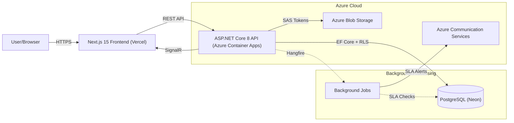

# ServiceDesk

[](https://github.com/muhammadusmanalhaq/ServiceDesk/actions/workflows/ci.yml)

ServiceDesk is a full-stack, enterprise-grade ticketing and IT service management platform built with ASP.NET Core 8 and Next.js.

## ✨ Features

- **Multi-Tenant RLS Isolation**: Strict data segregation between departments enforced directly at the database level.
- **JWT Authentication**: Secure login with robust refresh token rotation.
- **Real-Time Updates**: Live ticket status changes broadcasted instantly via SignalR.
- **SLA Tracking**: Background jobs with automated email alerts for SLA breaches.
- **File Attachments**: Secure document uploads via Azure Blob Storage SAS tokens.
- **Audit Trail**: Complete, immutable history with field-level diffs for every ticket.
- **End-to-End Test Coverage**: CI-tested exhaustive UI suites including a dedicated cross-tenant security test.
- **Containerized & Infrastructure-as-Code (IaC)**: Backend containerized via Docker and deployed using Bicep templates for repeatable, declarative cloud infrastructure.

## 🏗 Architecture

The system is split into two main components:
1. **Frontend:** Next.js 15 App Router SPA (Statically Exported) with TailwindCSS, deployed globally on **Vercel's Edge Network**.
2. **Backend:** ASP.NET Core 8 Web API, containerized via Docker, and deployed on **Azure Container Apps**.
3. **Database:** Serverless PostgreSQL on **Neon** with EF Core.



## 🚀 Live Demo (Production)

The application is fully deployed and live:
- **Frontend App:** [https://service-desk-mauve.vercel.app](https://service-desk-mauve.vercel.app)
- **API (Swagger UI):** [https://ca-servicedesk-api.wittysand-864c0963.uaenorth.azurecontainerapps.io/swagger/index.html](https://ca-servicedesk-api.wittysand-864c0963.uaenorth.azurecontainerapps.io/swagger/index.html)

## 🛠 Developer Guide (Local Setup)

Follow these steps to get the project running locally for development.

### 1. Prerequisites
- [.NET 8 SDK](https://dotnet.microsoft.com/download/dotnet/8.0)
- [Node.js](https://nodejs.org/) (v18+)
- **Docker Desktop**: Utilized (via `docker-compose`) to seamlessly spin up the local PostgreSQL database required by the API and Hangfire.
- (Optional) A [Neon](https://neon.tech/) account if you prefer a managed database.

### 2. Clone the Repository
```bash
git clone https://github.com/muhammadusmanalhaq/ServiceDesk.git
cd ServiceDesk
```

### 3. Database Configuration
You need two connection strings for the API to run:
- **Default:** Used by the application. In production, this runs as a restricted user where RLS policies are enforced.
- **System:** Used by Hangfire and migrations. This must be a superuser or the database owner.

Use `dotnet user-secrets` to configure these securely without committing them to source control:
```bash
cd src/ServiceDesk.Api
dotnet user-secrets set "ConnectionStrings:Default" "Host=YOUR_HOST;Database=neondb;Username=neondb_owner;Password=YOUR_PASSWORD;SslMode=Require;Trust Server Certificate=true"
dotnet user-secrets set "ConnectionStrings:System" "Host=YOUR_HOST;Database=neondb;Username=neondb_owner;Password=YOUR_PASSWORD;SslMode=Require;Trust Server Certificate=true"
dotnet user-secrets set "Jwt:Key" "a-very-long-and-secure-secret-key-that-is-at-least-256-bits!"
```

### 4. Run the Backend (API)
The application will automatically run EF Core migrations and seed the database with sample departments and users on startup.
```bash
dotnet run --project src/ServiceDesk.Api
```

### 5. Run the Frontend (UI)
The frontend is a **Next.js 15 App Router** application. In a new terminal window:
```bash
cd src/servicedesk-web
npm install
npm run dev
```
The frontend will start at `http://localhost:3000`.

## ⚙️ Environment Variables

The following environment variables (or user secrets) are required for the API:

| Variable | Description |
|----------|-------------|
| `ConnectionStrings__Default` | Application connection string. Used for general queries with RLS applied. |
| `ConnectionStrings__System` | System connection string. Used for EF migrations and background jobs (bypasses RLS). |
| `Jwt__Key` | Secret key used to sign JWT authentication tokens. |
| `Jwt__Issuer` | The issuer of the JWT tokens (default: `servicedesk-api`). |
| `Jwt__Audience` | The intended audience of the JWT tokens (default: `servicedesk-ui`). |
| `APPLICATIONINSIGHTS_CONNECTION_STRING` | (Optional) Azure Application Insights connection string for OpenTelemetry metrics/tracing. |
| `RateLimiting__PermitLimit` | (Optional) Override for login rate limit. Default is 5 (brute-force protection); CI overrides this for concurrent test workers. |

## 🧪 Testing

The solution includes a comprehensive suite of testing layers to guarantee application stability and security.

### Unit & Integration Tests
The backend test suite uses **Testcontainers** to automatically spin up a temporary, isolated PostgreSQL Docker container, run all migrations, seed data, and tear it down afterward. This guarantees that Row-Level Security (RLS) acts exactly as it does in production.
```bash
dotnet test
```

### End-to-End (E2E) Suite
The Playwright E2E suite exhaustively covers the UI and core workflows:
- **Core Workflows**: Complete ticket lifecycle (create → status transitions → verification) and login flows.
- **UI Coverage**: Thorough interaction testing of modals, dropdowns, filters, and form validation edge cases.
- **RBAC & RLS Violation Test**: A dedicated cross-tenant test verifies that Row-Level Security genuinely blocks agents from accessing other departments' data at the database level, not just in application logic (asserting a 404 response). This automated test acts as a regression guardrail, mathematically proving that no application-layer bug can ever leak cross-department data.

```bash
cd e2e
npx playwright test
```

### Continuous Integration (CI)
Our CI pipeline runs the full suite (unit, integration, E2E) on every push. Playwright is configured to record video and DOM traces, which are uploaded as downloadable GitHub Actions artifacts on every run.

## ⏱️ Performance Benchmarks (Azure Container Apps)

Because the API runs in a serverless environment (Azure Container Apps), cold-start latency is an important metric. Our latest tests show:

- **Cold Start (Initial Request):** ~2.5 - 3.5 seconds
  - *Includes loading .NET 8 runtime, establishing PostgreSQL/Neon connection pools, and executing EF Core model configuration.*
- **Warm Requests:** ~40 - 80 ms
  - *Sustained traffic hits the initialized endpoints with high throughput. Background jobs (Hangfire) keep the application semi-warm.*

## 🛣️ Roadmap

### Microsoft Entra ID (SSO) Integration
The next major architectural milestone is migrating authentication from the current ASP.NET Identity (local JWT) system to **Microsoft Entra ID**.
- **Why:** Centralized identity management for enterprise clients, enabling Conditional Access and seamless O365 integration.
- **How:** Replacing `JwtBearer` validation with Microsoft.Identity.Web, removing the local `RefreshTokens` table in favor of OIDC flows handled by the Next.js frontend (NextAuth.js) and validated by the API.
